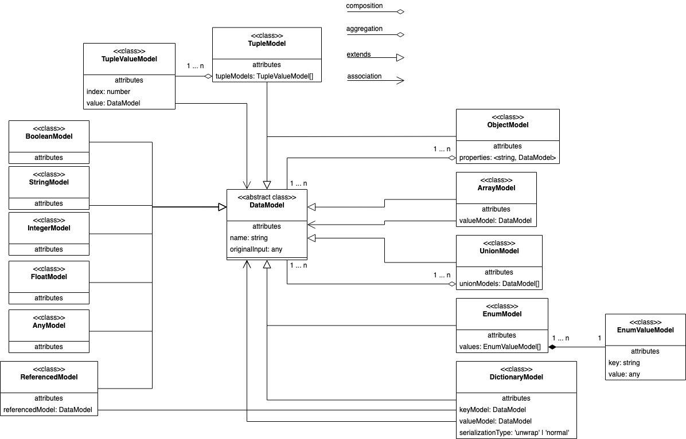
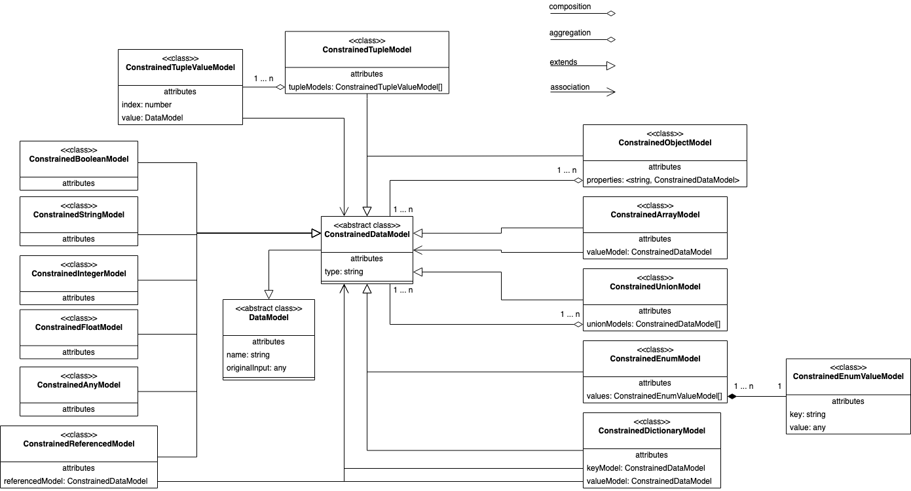

# The internal model language

It is important to understand the internal domain specific language that describes the models. It is what the input processors convert the inputs to, and the generators use to generate the models.

This is also the data types developers can use to create their own models, because they can provide a **raw data model** as input. This way you can create your own custom data models that can be interpreted to any output language, with the full sweep of features the generators and presets support. See [Create your own models from the ground up, instead of a supported input](./advanced#create-your-own-models-from-the-ground-up-instead-of-a-supported-input)

## The basics and process

There are two parts to the model, one for the input processors (the **raw data model**), which they convert to, and then the one that the generators receive (the **constrained data model**).

> For example (and this accounts for almost all languages) you cannot render a property with the name `my property`, generally they follow some kinda of common naming format such as using camel case `myProperty` or pascal case `MyProperty`.

The reason for these two data models, is because output languages (Java, TS, Go, etc) have very specific constraints. Above mentions just one of these constraints. Because each output language is dictated entirely by the output language, while the input knows nothing about those constrains.

Therefore the **raw data model** does not have any constraints, and it is perfectly normal and expected to name your properties `my property`. Before the model reaches the generator, it gets transformed to a **constrained data model**.

## The raw data model
These are the following raw data models that we are gonna support:
- **ArrayModel** is an unordered collection of a specific **DataModel**.
- **TupleModel** is an ordered collection of **DataModel**s.
- **EnumModel** is group of constants.
- **UnionModel** represent that the model can be either or other **DataModel**s.
- **ObjectModel** is a structure, that can be generated to class/interface/struct, etc, depending on the generator.
- **DictionaryModel** is a map/dictionary of key/value **DataModel**s.
- **ReferencedModel** is used for when a generator splits up models. See [The splitting of data models](#the-splitting-of-data-models).
- **BooleanModel** represent boolean values.
- **IntegerModel** represent natural numbers.
- **FloatModel** represent floating point numbers. 
- **StringModel** represent string values.
- **AnyModel** represent generic values that cannot otherwise be represented by one of the other models.

## The constrained data model

Extending the raw data models, we introduce the constrained data models. This is the model that generators and presets have access to. 

What exactly get's constrained?

- Enum values and keys
- Property names
- Data model names
- Data model type

How are they constrained?

The answer to this question is not straight forward, cause each language have unique constraints that the data models much adhere to. This is TBD.

## The splitting of data models
Each generator require a different splitting of the models since it varies which models should be rendered as is, and which need to be rendered separately.

For with the current TS generator, we should split:
- ObjectModel
- EnumModel (conditional, depends on the provided options, as inline string enums are possible) 

For the Java generator, we should split:
- ObjectModel
- EnumModel
- TupleModel (TS have these models natively supported, Java don't)
- UnionModel (TS have these models natively supported, Java don't)
