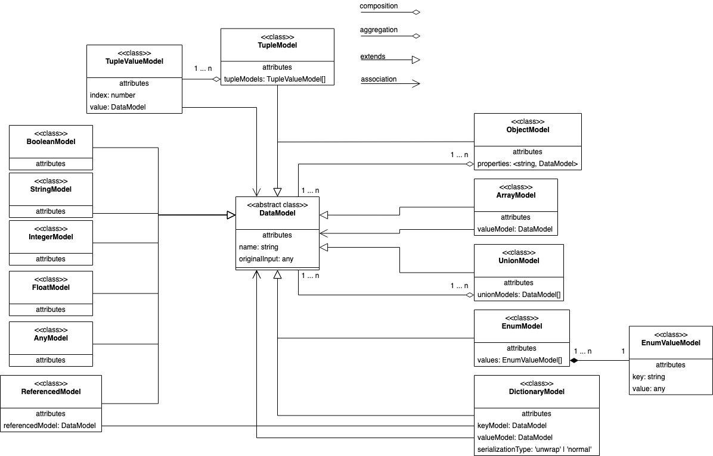

# The data model

In order to generate data models to from all kinds of inputs to all kinds of outputs, we need a common structure for how we define a data model.

## The basics and process

There are two parts to the model, one for the input processors (the **data model**), which they convert to, and then the one that the generators receive (the **constrained data model**).

For example (and this accounts for almost all languages) you cannot render a property with the name `my property`, generally, they follow some kind of common naming format such as using camel case `myProperty` or pascal case `MyProperty`.

This is the reason for having two data models because each output (Java, TS, Go, etc) have very specific constraints.

Therefore the **data model** does not have any constraints, and it is perfectly normal and expected to name your properties `my property`. Before the model reaches the generator, it gets transformed to a **constrained data model**.

  

The transformation happens in three stages. 

1. Process the input and transform it into the data model. See [The data model](#the-data-model) for more information.
2. Split the data model into separate models that are rendered separately. See [The splitting of data models](#The-splitting-of-data-models) for more information. 
3. Constrain the data models to the output language. See [The constrained data model](#the-constrained-data-model) for more information.

## The data model
The **data model** is what inputs (now and in the future) such as Protobuf, JSON Schema, JSON Type Definition, GraphQL types, are gonna be converted into. 

These are the data models and their meaning:
- **ArrayModel** is an unordered collection of a specific **DataModel**.
- **TupleModel** is an ordered collection of **DataModel**s.
- **EnumModel** is group of constants.
- **UnionModel** represent that the model can be either/or other **DataModel**s.
- **ObjectModel** is a structure, that can be generated to class/interface/struct, etc, depending on the output language
- **DictionaryModel** is a map/dictionary of key/value **DataModel**s.
- **ReferencedModel** is primarily used for when models should be split up and referenced, or it could be an external reference to an external entity. See [The splitting of data models](#the-splitting-of-data-models).
- **BooleanModel** represent boolean values.
- **IntegerModel** represent natural numbers.
- **FloatModel** represent floating-point numbers. 
- **StringModel** represent string values.
- **AnyModel** represent generic values that cannot otherwise be represented by one of the other models.

  

## The splitting of data models
Each generator requires a different splitting of the **data model**s because it varies which should be rendered as is, and which need to be rendered separately.

For example with the current TS generator, we split the following models:
- **ObjectModel**
- **EnumModel** (conditionally, as it depends on the provided options because [union string enums](https://github.com/asyncapi/modelina/blob/master/docs/languages/TypeScript.md#generate-union-types-instead-of-enums) are possible, and there they do not need a separate enum generator)

For the Java generator, we split the following models:
- **ObjectModel**
- **EnumModel**
- **TupleModel** (TS have these models natively supported, Java don't, so we need to generate alternatives)
- **UnionModel** (TS have these models natively supported, Java don't, so we need to generate alternatives)

## The constrained data model
Before a **data model** reaches the presets and renderers, it needs to be `constrained` to the output. 

For example, constraining the **EnumModel** in Java means taking the raw enum key (for the **data mode** there are no constrains to what values may be used) such as `something% something` and convert it to a compliant enum key that can be accessed directly, without having to call a renderer or somewhere else.

This means that if you used `EnumValueModel.key` you would get `something% something`, and with the Java constrained variant `ConstrainedEnumValueModel.key` you get (example) `SOMETHING_PERCENT_SOMETHING`.

How and what are constrained?

The answer to this question is not straightforward, cause each language has unique constraints that the data models much adhere to. This is TBD.

  

