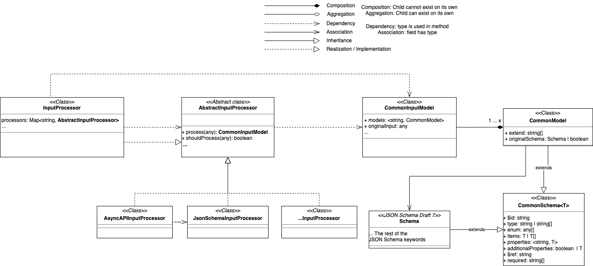

# Input processing
The input process is about processing any input into our internal model representation `CommonInputModel`. This most likely have to be done using different methods based on which kind of input it is.

As of now two inputs are supported:
- JSON Schema Draft 7
- AsyncAPI version 2.0.0

## Internal model representation

As seen on the class diagram the `InputProcessor` is our main point of entry for processing input data. It uses the defined other input processors (`AsyncAPIInputProcessor`, `JsonSchemaInputProcessor`, ...) by calling `shouldProcess` function of each and if the function returns true processing it using the `process` function. If no processes returns true it defaults to `JsonSchemaInputProcessor`. 

The `process` function are expected to return `CommonInputModel` which is a wrapper for the core data representation of `CommonModel`. This is done to ensure we can return multiple models for any input to allow for references, inheritance etc. As said the core internal representation of a data model is `CommonModel`. This contains the data definition by using known keywords from JSON Schema, but instead of it representing a validation rules it represent data definitions.

Here are the explanation of the different properties in `CommonModel`:
- `$id` is the id/name of the model.
- `type` this is the different types for the model. All types from JSON Schema are used, no custom types are used.
- `enum` defines the different enums for the model.
- `items` defines the type for `array` models as `CommonModel`.
- `properties` defines the properties and its expected types as `CommonModel`.
- `additionalProperties` are used to define if any extra properties are allowed, also defined as a  `CommonModel`.
- `$ref` is a reference to another `CommonModel` by using`$id` as a simple string.
- `required` list of required properties.
- `extend` list of other `CommonModel`s this model extends, is an array of `$id` strings.
- `originalSchema` is the actual input which this model represent.

## AsyncAPI
At the moment the library only supports the whole AsyncAPI file as input where it generates models for all defined message payloads. If any other kind of AsyncAPI input is wanted please create a [feature request](https://github.com/asyncapi/generator-model-sdk/issues/new?assignees=&labels=enhancement&template=enhancement.md)!

The AsyncAPI input processor expects that the property `asyncapi` is defined in order to know it should be processed using this.

The payload, since it is of type JSON Schema, is then passed to the [JSON Schema processor](#JSON-Schema) which handle the rest of the processing.

## JSON Schema
For us to convert JSON Schema into `CommonInputModel` we use a process we call the simplification process. This means that we simplify data validation rules (`Schema` or Boolean) into data definitions (`CommonModel`). This process is quite complex and needs it own section for explaining how it works.

Read [this](./docs/simplification.md) document for more information.
