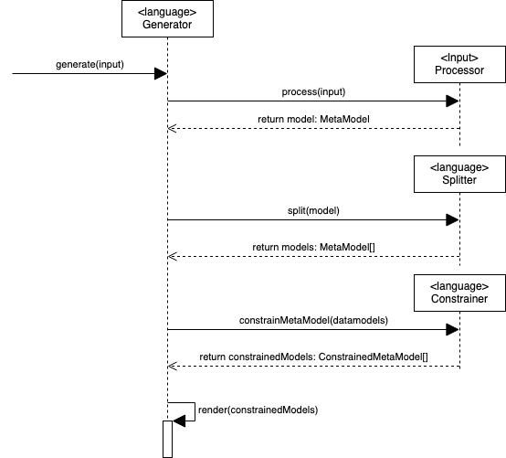

# The processor
Inputs generally don't have the faintest idea about the constraints of an output, and it is therefore the **meta model** does not have any constraints, and it is perfectly normal and expected to name your properties `my property`, or `"!"#/)"!`. 

Before the model reaches the presets, it gets transformed to a **constrained meta model**. Here it converts the raw **meta model** into only having valid values for the specific output. For example (and this accounts for almost all languages) you cannot render a property with the name `my property`, as most outputs don't allow properties to contain spaces and some common naming format such as `myProperty` or pascal case `MyProperty`. 

This transformation happen in three stages. 

  

1. Process the input and transform it into the meta model. See [the meta model](./internal-model.md#the-meta-model) for more information.
2. Split the meta model into separate models that are rendered separately. See [The splitting of meta models](#The-splitting-of-meta-models) for more information. 
3. Constrain the meta models to the output. See [The constrained meta model](./internal-model.md#the-constrained-meta-model) for more information.

## The splitting of meta models
Each generator requires a different splitting of the **meta model**s because it varies which should be rendered as is, and which need to be rendered separately.

For example with the current TS generator, we split the following models:
- **ObjectModel**, because we want to generate it into interfaces, or classes
- **EnumModel**, because we want to generate a representation for enums

For the Java generator, we split the following models:
- **ObjectModel**, because we want to generate it into a Java Class
- **EnumModel**, because we want to generate it into a Java Enum.
- **TupleModel** (TS have these models natively supported, Java don't, so we need to generate alternatives)
- **UnionModel** (TS have these models natively supported, Java don't, so we need to generate alternatives)

