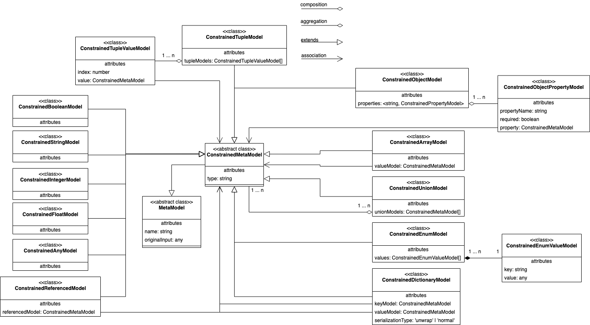

# Internal model

In order to generate data models from all kinds of inputs, we need a common structure for how we interact with one. That structure is called `MetaModel` often referred to as `Modelina Meta Model`, `Raw Meta Model`, or `MMM`. And there are two parts to it, there is the **meta model** and then the **constrained meta model**.

## The Meta Model
The **meta model** is what inputs (now and in the future) such as Protobuf, JSON Schema, JSON Type Definition, GraphQL types, are gonna be converted into. This is also an input in it'self that you can provide Modelina to create your own input processor.

These are the meta models and their meaning:
- **ArrayModel** is an unordered collection of a specific **MetaModel**.
- **TupleModel** is an ordered collection of **MetaModel**s.
- **EnumModel** is group of constants.
- **UnionModel** represent that the model can be either/or other **MetaModel**s.
- **ObjectModel** is a structure, that can be generated to class/interface/struct, etc, depending on the output language
- **DictionaryModel** is a map/dictionary of key/value **MetaModel**s.
- **ReferencedModel** is primarily used for when models should be split up ([see the splitting of meta models](#the-splitting-of-data-models)) and referenced, or it could be an external reference to an external entity.
- **BooleanModel** represent boolean values.
- **IntegerModel** represent natural numbers.
- **FloatModel** represent floating-point numbers. 
- **StringModel** represent string values.
- **AnyModel** represent generic values that cannot otherwise be represented by one of the other models.

  

## The Constrained Meta Model

Before the **meta models**s reaches the generator, it needs to be `constrained` to the output. 

For example, constraining the **EnumModel** in Java means taking the raw enum key (for the **meta model** there are no constrains to what values may be used) such as `something% something` and convert it to a compliant Java enum key that can be accessed directly in the generator and presets.

This means that if you accessed `EnumValueModel.key` you would get `something% something`, and with the Java constrained variant `ConstrainedEnumValueModel.key` you get (example) `SOMETHING_PERCENT_SOMETHING`.

How and what are constrained?

The answer to this question is not straightforward, cause each output has unique constraints that the meta models must adhere to. You can read more about [the constraint behavior here](./constraints.md).

  

