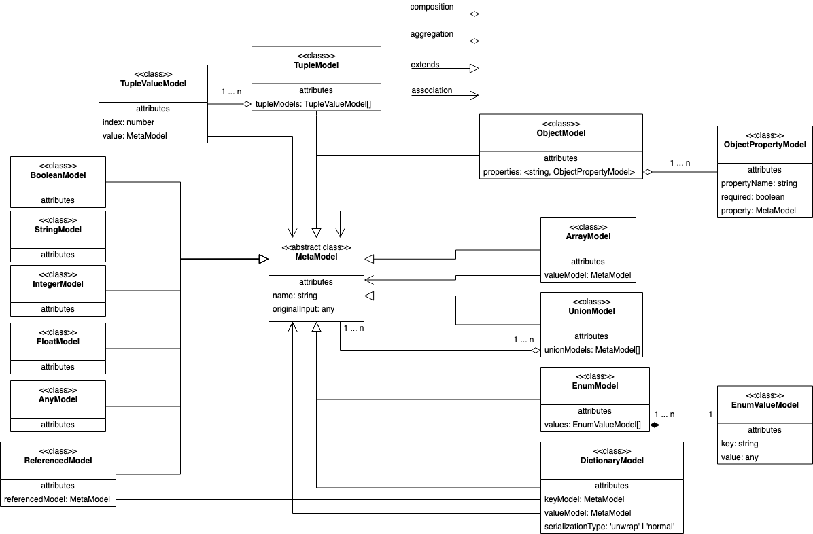

# The meta model
The **meta model** is what inputs (now and in the future) such as Protobuf, JSON Schema, JSON Type Definition, GraphQL types, are gonna be converted into. 

These are the meta models and their meaning:
- **ArrayModel** is an unordered collection of a specific **MetaModel**.
- **TupleModel** is an ordered collection of **MetaModel**s.
- **EnumModel** is group of constants.
- **UnionModel** represent that the model can be either/or other **MetaModel**s.
- **ObjectModel** is a structure, that can be generated to class/interface/struct, etc, depending on the output language
- **DictionaryModel** is a map/dictionary of key/value **MetaModel**s.
- **ReferencedModel** is primarily used for when models should be split up ([see the splitting of meta models](#the-splitting-of-data-models)) and referenced, or it could be an external reference to an external entity.
- **BooleanModel** represent boolean values.
- **IntegerModel** represent natural numbers.
- **FloatModel** represent floating-point numbers. 
- **StringModel** represent string values.
- **AnyModel** represent generic values that cannot otherwise be represented by one of the other models.

  

